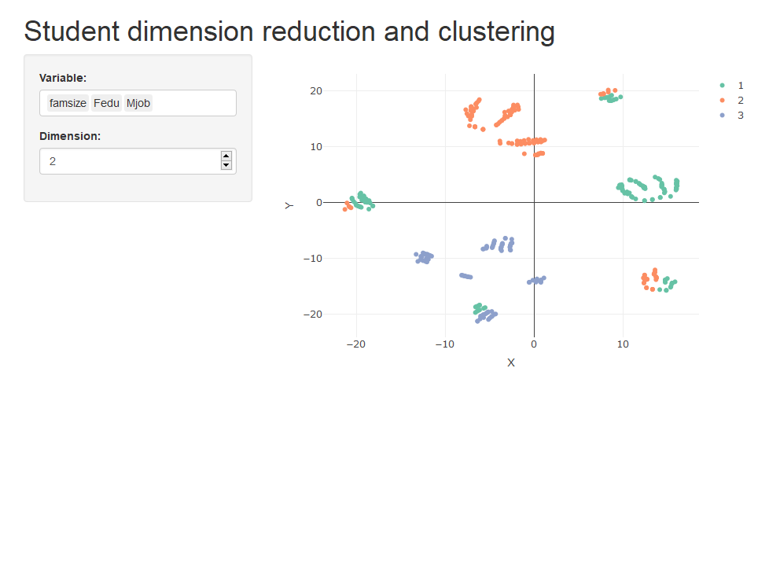

The App that lets you make cluster in reduced dimension using tSNE based on selected variables.

# Data source
The data used is coming from :
https://archive.ics.uci.edu/ml/datasets/Student+Performance
Only the maths grades file is used here for demonstration only.

# Objective of the app
make cluster in reduced dimension using tSNE and a k-means like clustering algorithm with a custom distance that handles mixed type variables

# How to get the app

1st  :
You can dowload the code from github open the ui.R and run the app in RStudio

2nd method : 
Or directly the image of the app available at https://hub.docker.com/r/dimenoste/clusterapp
To get the image and run it locally on your computer
you need docker installed on your machine.
Enter in your terminal :
1. docker pull dimenoste/clusterapp:latest
2. docker run -d -p 3838:3838 dimenoste/clusterapp
3. go to your brower and enter 127.0.0.1:3838 in the url search bar.

Warning : 
Be sure, the port 3838 is free
The app size is 1.72GB. It can be slow to get it opened locally. 
If after 3 minutes, the app is not visible in your browser, you have to refresh it !

# How to use the app
You can select some variables used to group the students.
The dimension to see the groups is either 2 or 3.
The plots are interactive and you can hover over the points, zoom, et ...

As an indicator of student's performance, the final grade G3 is visible when you hover over the points with the mouse.

# Test the integrity of the app
As a sanity check,see if you can replicate the output from shinytest

# Stack
app made in "Shiny" with "renv" a library that lets you isolate packages by project.
